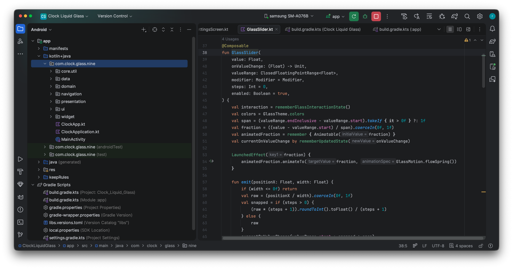
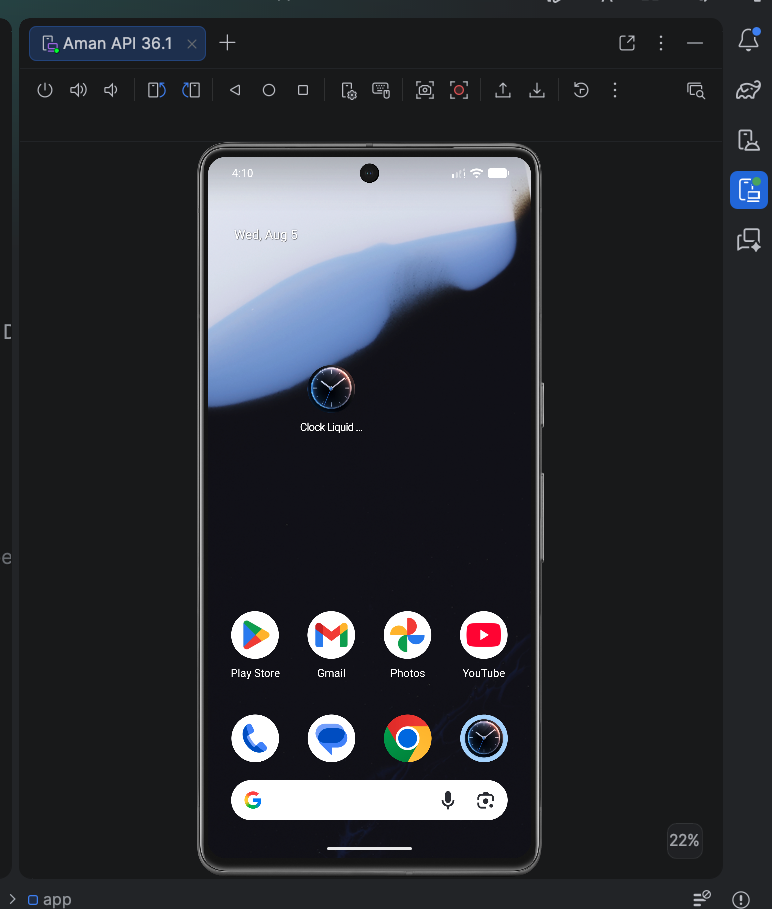
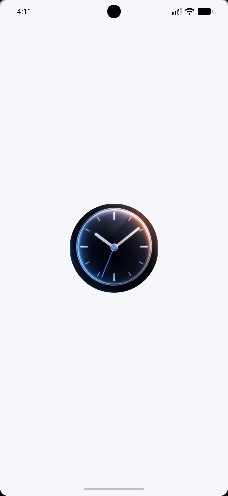
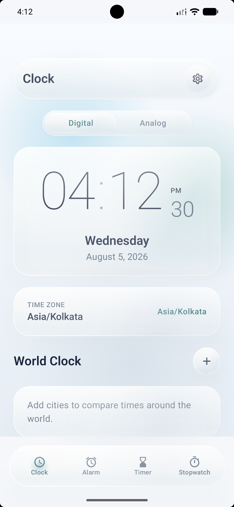
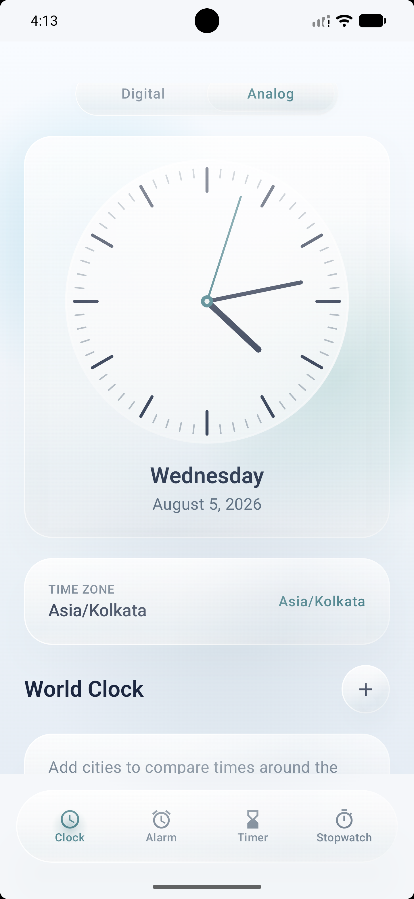
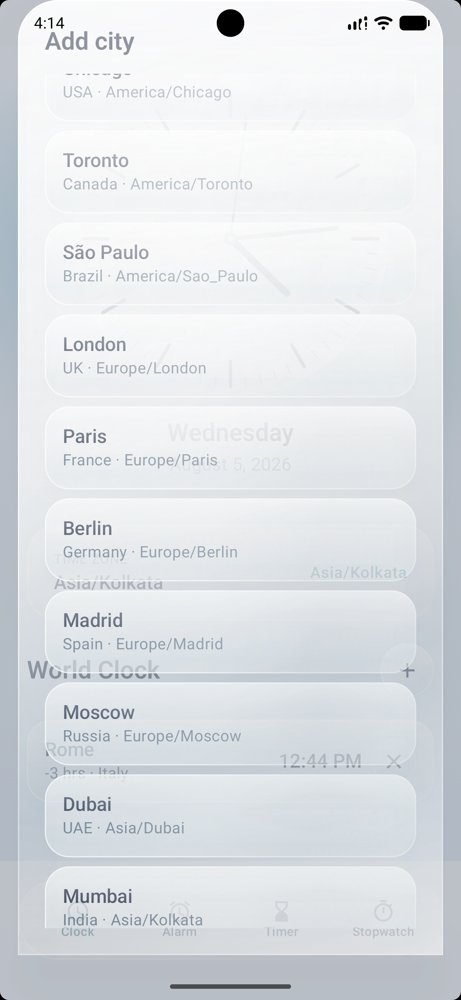
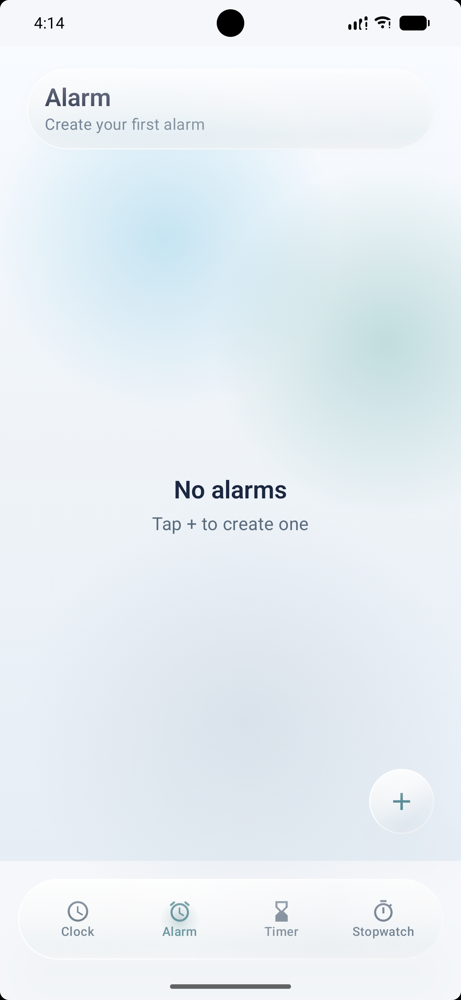
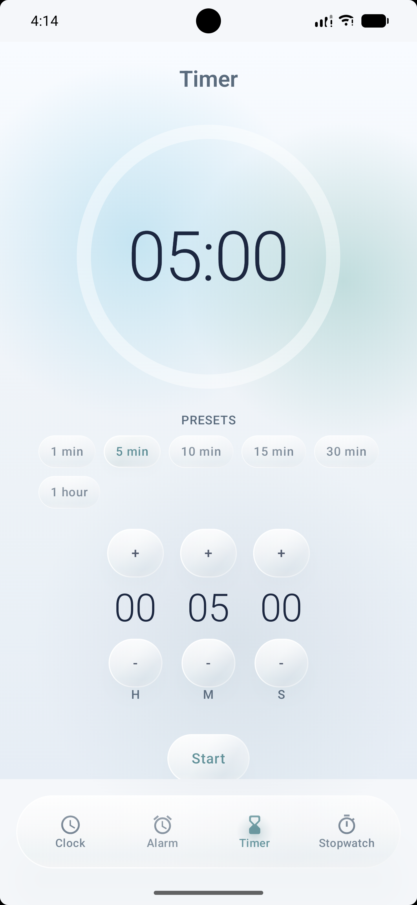
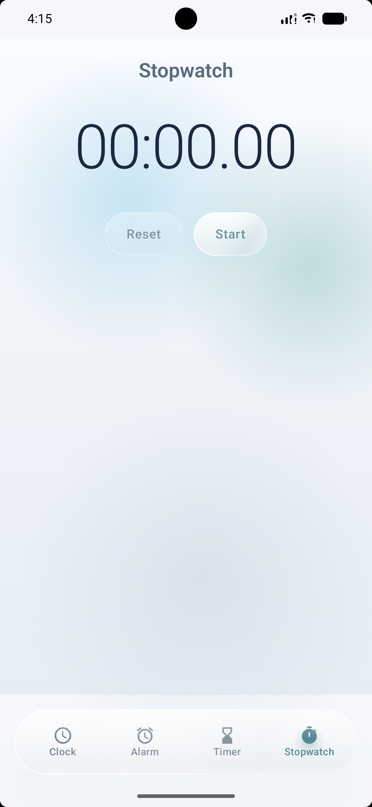
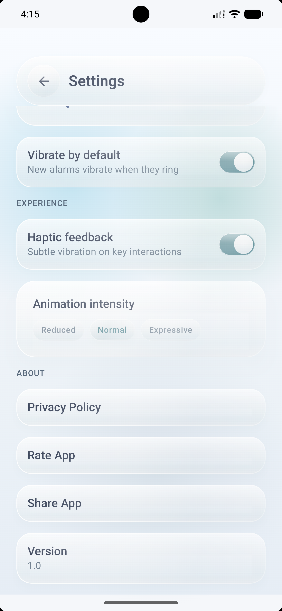

# Clock Liquid Glass

An Android Clock application built with Kotlin and Jetpack Compose, inspired by Apple's Liquid Glass design language. This project focuses on creating a clean, modern, and responsive user experience while implementing a reusable glass-based design system across the application.

<p align="center">
  
</p>

<p align="center">
  
  
  
</p>

<p align="center">
  
  
  
</p>

<p align="center">
  
  
  
</p>

---

## About

Clock Liquid Glass is a modern Android Clock application designed to explore premium UI design and smooth user interactions. The interface is inspired by Apple's Liquid Glass design language while being fully implemented for Android using Jetpack Compose and modern Android development practices.

The project was built from the ground up with a reusable design system, clean architecture, and scalable components, making it easy to extend and maintain.

---

## Features

### Clock

- Live digital clock
- World Clock support
- Add and manage multiple cities
- Smooth transitions and animations

### Alarm

- Create, edit and delete alarms
- Enable or disable alarms
- Clean and intuitive alarm management
- Responsive interaction design

### Timer

- Preset timer shortcuts
- Custom hour, minute and second selection
- Animated countdown interface
- Smooth glass-inspired controls

### Stopwatch

- Start, pause and reset
- Accurate time tracking
- Responsive controls
- Clean minimal interface

### Liquid Glass Design System

- Reusable glass components
- Custom typography
- Dynamic colors
- Glass cards and buttons
- Smooth motion and transitions
- Consistent design language
- Responsive layouts

---

## Tech Stack

- Kotlin
- Jetpack Compose
- MVVM Architecture
- Material 3
- Navigation Compose
- State Management
- AndroidX
- Coroutines
- Animation APIs
- Android Studio
- Git
- GitHub

---

## What I Learned

Working on this project helped me improve my understanding of:

- Building complete Android applications with Jetpack Compose
- Designing reusable UI systems
- Creating custom Compose components
- Managing application state
- Navigation in Compose
- Animation and motion design
- Responsive layouts for different screen sizes
- Clean Architecture principles
- MVVM Architecture
- Performance optimization
- Writing scalable and maintainable Android code

---

## Project Structure

```text
app/
├── data/
├── domain/
├── navigation/
├── presentation/
├── ui/
├── widget/
└── core/
```

---

## Future Improvements

- Wear OS support
- Dynamic themes
- Additional clock widgets
- More personalization options
- Accessibility improvements
- Performance refinements

---

## Developer

### Aman Sharma

Android Developer passionate about building modern Android applications with Kotlin and Jetpack Compose. I enjoy creating polished user experiences, reusable UI systems, and scalable Android architectures while continuously learning new technologies.

**GitHub**

https://github.com/engineer-aman-sharma

**LinkedIn**

https://www.linkedin.com/in/engineer-aman-sharma

---

## Acknowledgements

The visual direction of this project is inspired by Apple's Liquid Glass design language. This project is an independent Android implementation created for learning, experimentation, and portfolio purposes. It is not affiliated with or endorsed by Apple.